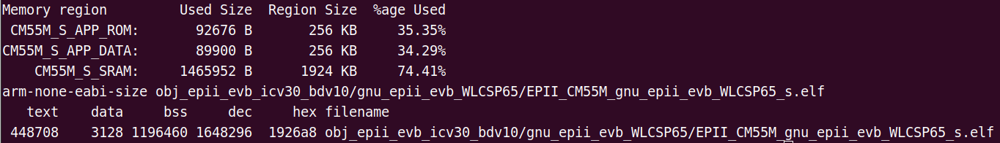

# Himax allon_sensor_tflm_freertos example for Seeed Grove Vision AI Module V2

## How to build the firmware?
This part explains how you can build the firmware for Grove Vision AI Module V2.
Note: The following has been tested to work on Ubuntu 20.04 PC
- Step 1: Install the following prerequisites
    ```
    sudo apt install make
    ```
- Step 2: Download Arm GNU Toolchain (arm-gnu-toolchain-13.2.rel1-x86_64-arm-none-eabi.tar.xz)
    ```
    cd ~
    wget https://developer.arm.com/-/media/Files/downloads/gnu/13.2.rel1/binrel/arm-gnu-toolchain-13.2.rel1-x86_64-arm-none-eabi.tar.xz
    ```
- Step 3: Extract the file
    ```
    tar -xvf arm-gnu-toolchain-13.2.rel1-x86_64-arm-none-eabi.tar.xz
    ```
- Step 4: Add arm-gnu-toolchain-13.2.Rel1-x86_64-arm-none-eabi/bin/: to PATH
    ```
    export PATH="$HOME/arm-gnu-toolchain-13.2.Rel1-x86_64-arm-none-eabi/bin/:$PATH"
    ```
- Step 5: Compile the firmware
    ```
    cd EPII_CM55M_APP_S
    ```
    You need to change the path inside the makefile to the path of the compiler. Such as:
    ```
    GNU_TOOLPATH ?= /mnt/c/Users/mengd/Desktop/arm-gnu-toolchain-13.2.Rel1-x86_64-arm-none-eabi/bin/
    ```
    Then,
    ```
    make clean
    make
    ```
- Output elf file: `./obj_epii_evb_icv30_bdv10/gnu_epii_evb_WLCSP65/EPII_CM55M_gnu_epii_evb_WLCSP65_s.elf`
    
- Step 6: Generate firmware image file
    ```
    ./output.sh
    ```
- Output firmware image: `./output_case1_sec_wlcsp/output.img`
    

## How to flash the firmware?
This part explains how you can flash the firmware to Grove Vision AI Module V2.
### System Requirement
1. Grove Vision AI Module V2
2. Connection cable
    - Micro usb cable: connect to EVB (as Power/UART)
3. Software Tools
    Serial terminal emulation application
    - In the following description, `TeraTerm` and `Minicom` will be used.
        - Serial terminal emulation application Setting
            - Baud Rate 921600 bps
            - Data		8 bit
            - Parity		none
            - Stop		1 bit
            - Flow control	none
            - please check xmodem protocol is supported.

    ```
    pip install xmodem --user
    python flasher.py we2_image_gen_local/output_case1_sec_wlcsp/output.img COM3
    ```

    ```
    pip install playsound --user
    python getdate.py
    ```

